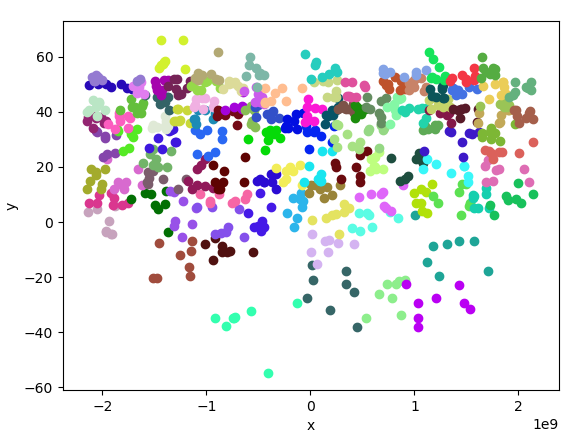
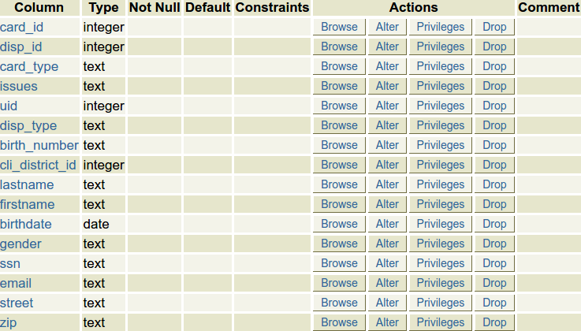

# General Presentation

This is a framework about the databases anonymization based on the [GDA Score framework](https://www.gda-score.org/). The goal of this framework is to generate anonymized databases from the raw database. This should be used for example to publish data from a client database that contains sensitive attributes while keeping the identity of the clients secret.

## How does it work

This framework can be used to apply the [K-anonymization](https://en.wikipedia.org/wiki/K-anonymity) and the [L-Diversity](https://en.wikipedia.org/wiki/L-diversity) on a database. For this, the framework will process the data in four different steps described below.

### Step 1 : Fetching the data

This first step consists in downloading the data from a data source that could be either a MySQL Database or [GDA Score database](http://db001.gda-score.org). It will create a CSV file with the raw data from the database.

### Step 2 : Pre-Processing

The goal of this step is to transform the raw data before the application of the [K-anonymization](https://en.wikipedia.org/wiki/K-anonymity) and [L-Diversity](https://en.wikipedia.org/wiki/L-diversity). It will basically delete the [direct identifiers](#direct-identifiers) and transform the [quasi-identifiers](#quasi-identifiers) in numbers. This step is mandatory since it prepares the data in the right format for the [processing](#step-3-processing) step which requires only numeric values.

### Step 3 : Processing

For this section we will use the following dataset as example.

<center>

| QUID1 | QUID2 | Sensitive |
| ----- | ----- | --------- |
| 1     | 5     | a         |
| 2     | 6     | a         |
| 3     | 7     | b         |
| 4     | 8     | c         |

Initial dataset

</center>

This third step will do the anonymization itself using the [K-anonymization](https://en.wikipedia.org/wiki/K-anonymity) and [L-Diversity](https://en.wikipedia.org/wiki/L-diversity). This will group the lines in clusters of K elements using the [Mondrian algorithm](https://personal.utdallas.edu/~mxk055100/courses/privacy08f_files/MultiDim.pdf). The advantage is that the generated clusters will group together lines of the database that are similar.

<center>



Example for K=8 in a set of 1000 random data lines

</center>

This clustering allow to group users in clusters of K or more individuals without decreasing the utility score too much since the [quasi-identifiers](#quasi-identifiers) will be mostly the same between individuals of a given cluster. It will prevent an attacker from finding someone specifically in the base. At worst, he will only be able to identify the cluster of someone and will not be able to distinguish this person from the K-1 other members of the cluster.

<center>

| QUID1 | QUID2 | Sensitive |
| ----- | ----- | --------- |
| [1,2] | [5,6] | a         |
| [1,2] | [5,6] | a         |
| [3,4] | [7,8] | b         |
| [3,4] | [7,8] | c         |

K-Anonymization for K=2 on the initial dataset

</center>

The previous step makes it impossible to find the identity of someone in the base, even when knowing his [quasi-identifiers](#quasi-identifiers). However, it is still possible to find the sensitive values for someone. For example, in the first cluster we can't distinguish the person with `QUID1=1` and `QUID2=5` from the person with `QUID1=2` and `QUID2=6`, but we can be sure that these persons have 'a' as sensitive value, since this is the single sensitive value in the cluster.
This is why we apply also the [L-Diversity](https://en.wikipedia.org/wiki/L-diversity). Our algorithm is naive. The idea here is to group clusters together until they have at least L different values for the sensitive value. We isolate all the non-l-diverse clusters and then merge them two by two. We put back the outgoing l-diverse clusters, and we start again the algorithm with the clusters that still do not satisfy the l-diversity. With this additional step, even if the attacker can find the correct cluster of someone, he will have L possible values for the sensitive value.

<center>

| QUID1 | QUID2 | Sensitive |
| ----- | ----- | --------- |
| [1,4] | [5,8] | a         |
| [1,4] | [5,8] | a         |
| [1,4] | [5,8] | b         |
| [1,4] | [5,8] | c         |

K-anonymization for K=2 then L-diversity with L=2

</center>

### Step 4 : Post-Processing

This step is used to generalise the clusters from the QUID values. It is from this point that the final representation with intervals of the clusters are really created. This step also allows to reverse the numeric values from the [quasi-identifiers](#quasi-identifiers) to their original values, since we transformed them in the [pre-processing step](#step-2-pre-processing).

### Direct Identifiers

The direct identifiers are the columns that allow for an attacker to find someone specifically, e.g. the `social security number` or the `email` columns.

### Quasi Identifiers

The quasi-identifiers are the columns that allow for an attacker to find someone specifically when they are combined, e.g. the `firstname and lastname` or the `birthdate and birthplace` columns. You can't find anyone specifically with only one of these columns but when they are put together, you can reduce the amount of possibilities so drastically that you can find someone specifically.

### Sensitive Data

The sensitive data are the columns that you want to publish without letting the possibility for an attacker to find the person attached to this value. It can be the case for `diseases`, `place` or `date` for example.

### Lambda Data

These data are the columns that don't really identify someone and that are not sensitive. In this case, we just keep them as they are without changing anything.

# Quick Start

## MySQL Installation

Before anything, this framework requires a [MySQL server](https://dev.mysql.com/), so you will need to install one.
For this, the following should do the trick.

```bash
sudo apt update
sudo apt install mysql-server
```

The process will prompt you for a password for the root user of MySQL. You just have to follow the instruction on screen.
Then enter following command to get a secure configuration for your server.

```bash
sudo systemctl restart mysql
sudo mysql_secure_installation
```

Once this is done, your server is running and can be used. However, for security issues it isn't a good idea to use your server with the root account, so it is a good idea to create a specific user for the application.

```bash
sudo mysql -uroot -p
#Then type your password for the mysql root user.
```

```sql
CREATE USER 'newuser'@'localhost' IDENTIFIED BY 'password';
GRANT ALL PRIVILEGES ON * . * TO 'newuser'@'localhost';
FLUSH PRIVILEGES;
```

## Python Packages

You can download the python package from our [github](http://TODO.com).
You need to have the at least the anonymization package in your project.

```bash
your_project
├── anonymization
└── main.py
```

If you want to use the framework with the default parameters, you will need to also have `cache` and `export` folders in the root of your project.

```bash
your_project
├── anonymization
├── cache
├── export
└── main.py
```

## Requirements

You also need to download the `requirement.txt` file from the root of the [github](http://TODO.com) and install each package required with the following

```bash
pip install -r requirement.txt
```

# How To Use

For this section we will use the following table as example.

<center>

| name    | birthdate  | email                       | gender | disease |
| ------- | ---------- | --------------------------- | ------ | ------- |
| Bill    | 1969-10-04 | bill.gates@laposte.net       | M      | COVID   |
| Michael | 1988-01-05 | michael.jackson@outlook.com | M      | SIDA    |
| Joanne  | 1997-11-09 | joanne.rowling@yahoo.com    | F      | CANCER  |

An example of a medical table for this section

</center>

## Structuring the database

First you will need to provide the structure of your table to the framework. For this, we use a `dictionary` with column names as keys and column types as values.
The database types are represented with the class `anonymization.preprocessing.DBTYPES`.

The available types are the following

| Type               | Description                          |
| ------------------ | ------------------------------------ |
| DBTYPES.INTEGER()  | Any integer value (boolean included) |
| DBTYPES.REAL()     | Any real value                       |
| DBTYPES.TEXT()     | A string (size does not matter)        |
| DBTYPES.DATE()     | Any date without time                |
| DBTYPES.DATETIME() | Any date with time                   |

?> Note that for each of these types you can pass three arguments `capacity=None, pk=False, autoincrement=False`

For the example table, we can  write the following :

```python
table_structure = {"name" : DBTYPES.DATETIME(),
                   "birthdate": DBTYPES.DATE(),
                   "email": DBTYPES.TEXT(),
                   "gender": DBTYPES.TEXT(), #Note that we could have used DBTYPE.INTEGER() if the gender was boolean
                   "disease": DBTYPES.TEXT()}
```

## Selecting the fields type

The framework will also require you to provide the [direct identifiers](#direct-identifiers), [quasi-identifiers](#quasi-identifiers) and [sensitive columns](#sensitive-data). We can for the given example do the following :

```python
ignore_fields = ["email"] #The direct identifier since they are just ignored and forgotten
quid_cols = ["birthdate", "name", "gender"]
sensitive_cols = ["disease"]
```

There are also some exceptions that should be indicated.
First, you can provide a list of columns that represents positions. If there are string fields that represent a location (street/land/address...), we can use the [open street map API](https://wiki.openstreetmap.org/wiki/API) to transform them in their latitude and longitude values to get a more pertinent result from the [processing](#step-3-processing). In the other hand, processing can be time consuming since each different value will generate a request to the [open street map api](https://wiki.openstreetmap.org/wiki/API). This is the reason why we generate a cache file to avoid duplicating requests that have already been done. Since the data set can already contain latitude and longitude it is also possible to provide a list of tuples with two elements (the columns representing the latitude and longitude).

Example :

```python
position_fields = ["pickup_address", "dropoff_address"]
position_in_lat_lon = [("pickup_latitude", "pickup_longitude"), ("dropoff_latitude", "dropoff_longitude")]
```

There is a last exception regarding the columns that have few different values or for which similar values can have drastic meaning differences. For these columns, the most pertinent way to make the pre-processing is by using an index. So you can provide columns that should be indexed.
    
Example :

```python
indexation = ["client_type"]
```

## Running the anonymization

To anonymize a table there is the `annonimize.annonymizeGDATable` that will do the job. This function takes a lot of arguments that are described in the following :

| Argument name                  | Default Value                              | Required | Meaning                                                                                                                                                                                                                                                                                                                                                                                                                                                   |
| ------------------------------ | ------------------------------------------ | -------- | --------------------------------------------------------------------------------------------------------------------------------------------------------------------------------------------------------------------------------------------------------------------------------------------------------------------------------------------------------------------------------------------------------------------------------------------------------- |
| username                       | None                                       | true     | The username to use to connect to the local MySQL database.                                                                                                                                                                                                                                                                                                                                                                                                |
| password                       | None                                       | true     | The password matching the previous username for the local MySQL database.                                                                                                                                                                                                                                                                                                                                                                                 |
| dbname                         | None                                       | true     | The name of the local database to use (if the database does not exist, it will be created).                                                                                                                                                                                                                                                                                                                                                                          |
| tablename                      | None                                       | true     | The name of the table in the local database (it will be created if it does not exist).                                                                                                                                                                                                                                                                                                                                                                                        |
| gda_dbname                     | None                                       | true     | The name of the source database, it can be a [GDA database](http://db001.gda-score.org) or a local database. If a local database is used the `local_table_already_exist` argument should be set to `True`.                                                                                                                                                                                                                                                       |
| gda_tablename                  | None                                       | true     | The name of the table with the raw values in the database.                                                                                                                                                                                                                                                                                                                                                                                                  |
| table  _structure              | None                                       | true     | A dictionary that describes the structure of the table such as seen in the [structuring the database](#structuring-the-database) section.                                                                                                                                                                                                                                                                                                                  |
| ignore_fields                  | None                                       | true     | A list with all the [direct identifiers](#direct-identifiers) fields as seen in the [selecting the fields type](#selecting-the-fields-type) section.                                                                                                                                                                                                                                                                                                  |
| position_fields                | None                                       | true     | A list with all the columns that represents real location with strings as seen in the [selecting the fields type](#selecting-the-fields-type) section.                                                                                                                                                                                                                                                                                                  |
| index_field                    | None                                       | true     | A list with all the columns that should be indexed as seen in the [selecting the fields type](#selecting-the-fields-type) section.                                                                                                                                                                                                                                                                                                                     |
| quid_list                      | None                                       | true     | A list with all the columns that are quasi-identifiers as seen in the [selecting the fields type](#selecting-the-fields-type) section.                                                                                                                                                                                                                                                                                                               |
| sensitive_list                 | None                                       | true     | A list with all the columns that are sensitive as seen in the [selecting the fields type](#selecting-the-fields-type) section.                                                                                                                                                                                                                                                                                                                       |
| k                              | None                                       | true     | The value for the `K-Anonymity` processing. This will hide a user behind at least K other users.                                                                                                                                                                                                                                                                                                                                                           |
| postion_in_lat_lon             | []                                         | false    | A list of tuples that contains the pairs of columns for latitude and longitude as seen in the [selecting the fields type](#selecting-the-fields-type) section.                                                                                                                                                                                                                                                                                           |
| gda_rawfile                    | "export/raw*gda*{}\_{}.csv"                | false    | The file to save the raw data, filename can use placeholder(s) (`{}`) to place the database and table names. By default, it uses the export directory that need to be created manually.                                                                                                                                                                                                                                                                         |
| preproceceed_file              | "export/preproceceed*{}*{}.csv"            | false    | The file to save the preprocessed data, filename can use placeholder(s) (`{}`) to place the database and table name. By default, it uses the export directory that need to be created manually.                                                                                                                                                                                                                                                               |
| proceceed_file                 | "export/proceceed*{}*{}.csv"               | false    | The file to save the processed data, filename can use placeholder(s) (`{}`) to place the database and table names.  By default, it uses the export directory that has to be created manually.                                                                                                                                                                                                                                                                   |
| clear_preprocecedd_file        | "export/clear*proceceed*{}\_{}.csv"        | false    | The file to save the processed data after reversing the values, filename can use placeholder(s) (`{}`) to place the database and table names. By default, it uses the export directory that has to be created manually.                                                                                                                                                                                                                                    |
| postprocecedd_file             | "export/postproceceed*{}*{}.csv"           | false    | The file to save the post-processed data (`the annonimysed table`), filename can use placeholder(s) (`{}`) to place the database and table names. By default, it uses the export directory that has to be created manually.                                                                                                                                                                                                                                     |
| gda_rawfile_limit              | `None`                                     | false    | When downloading the data from a [GDA database](http://db001.gda-score.org), you can limit the number of rows by setting here an integer that represents the max number of rows that should be used.                                                                                                                                                                                                                                                                   |
| gda_raw_transform              | {}                                         | false    | A dictionary that has column name as key and function as value. The functions take a full line of data and return a value for the corresponding column. Each supplied field is transformed using the function before the creation of the local table.                                                                                                                                                                                                   |
| indexation_rate                | 10                                         | false    | The maximum number of distinct values in a column to index the field. Can be an integer for a fixed count of values or a float between 0 and 1 for a percentage of the total rows count. The column in the indexation parameter ignores this.                                                                                                                                                                                                                   |
| str_sort_function              | preprocessing.sortStringListBySimilarity | false    | A function that sorts strings so that similar strings have index close to each other. By default the following functions are defined `preprocessing.sortStringListBySimilarity`, `preprocessing.sortStringListBySimilarityButFast` and `preprocessing.sortStringListBySimilarityButVeryFast`. It is also possible to define your own function and to use it.                                                                            |
| preprocecing_transform_columns | {}                                         | false    | A dictionary that has the column name as key and a function that takes a complete line and return a numeric value for the corresponding key.                                                                                                                                                                                                                                                                                                              |
| show_clusers                   | False                                      | false    | A boolean that will log or not the clusters (can generate big files of log).                                                                                                                                                                                                                                                                                                                                                                               |
| cluster_transforms             | []                                         | false    | A list of functions that take tree arguments: the raw line, the processed line and the result and edit it.                                                                                                                                                                                                                                                                                                                                                   |
| local_db_host                  | "127.0.0.1"                                | false    | The host to connect to access to the local MySQL server.                                                                                                                                                                                                                                                                                                                                                                                                  |
| local_db_port                  | 3306                                       | false    | The port to use to connect to the local MySQL server.                                                                                                                                                                                                                                                                                                                                                                                                     |
| use_cache                      | True                                       | false    | Set to True if you want to redownload the raw data from the source even if the `gda_rawfile` file already exists.                                                                                                                                                                                                                                                                                                                                          |
| local_table_already_created    | False                                      | false    | A boolean that allows to select the data source between the local database and the [GDA database](http://db001.gda-score.org). If `True`, you will use the local database. If `False` you will use the [GDA database](http://db001.gda-score.org).                                                                                                                                                                                                                                 |
| enable_log                     | False                                      | false    | A boolean to enable or disable the creation of log. Set to `True` to enable them and `False` to disable them.                                                                                                                                                                                                                                                                                                                                             |
| pk_colname                     | "id"                                       | false    | The name for the autogenerated primary key column. To reverse the clusters during the [postprocessing step](#step-4-post-processing) we need to generate a primary key for the table and to ignore the existing one (making them normal columns that you probably want to ignore using the `ignore_fields` parameter). The column autogenerated is called `"id"`, however if you already have a column named `"id"`, you will have to change this column name. |

## Full Example

### Using GDA

Here is an example applied on the `cards` table from the `raw_banking` database from [GDA](https://db001.gda-score.org/). This table original structure is :

<center>



</center>

```python
from anonymization.annonymizeGDATable import *
from anonymization.preprocessing import *
import datetime

table_structure = {"card_id":DBTYPES.INTEGER(),
                  "disp_id":DBTYPES.INTEGER(),
                  "card_type":DBTYPES.TEXT(),
                  "uid" : DBTYPES.INTEGER(),
                  "issues" : DBTYPES.TEXT(),
                  "disp_type" : DBTYPES.TEXT(),
                  "birth_number": DBTYPES.INTEGER(),
                  "cli_district_id" : DBTYPES.INTEGER(),
                  "lastname" : DBTYPES.TEXT(),
                  "firstname": DBTYPES.TEXT(),
                  "birthdate": DBTYPES.INTEGER(),
                  "gender": DBTYPES.TEXT(),
                  "ssn": DBTYPES.TEXT(),
                  "email" : DBTYPES.TEXT(),
                  "street": DBTYPES.TEXT(),
                  "zip" : DBTYPES.TEXT()}

ignore_fields = ["ssn", "uid", "zip", "card_id", "disp_id", "disp_type", "birth_number", "lastname", "firstname", "email", "issues"]
quid_cols = ["cli_district_id", "street", "birthdate"]
sensitive_cols = ["card_type", "gender"]

position_fields = ["street"]
indexation = []

def birthDateToAge(ligne):
    currentyear = datetime.datetime.now().year
    return currentyear - datetime.datetime.strptime(ligne["birthdate"], "%Y-%m-%d").year

raw_transform = {"birthdate" : birthDateToAge}


annonymizeGDATable("username", "password",                      #The credentials for the local database
                   "banking", "cards",                          #Database and table name for the local database
                   "raw_banking", "cards",                      #Database and table name for the GDA database
                   table_structure, ignore_fields, position_fields, indexation, quid_cols, sensitive_cols,
                   4,                                           #Value for K
                   2,                                           #Value for L
                   gda_raw_transform=raw_transform, use_cache=False)
```

### Using Local Table

Here we will generate and anonymize a medical table with the following structure :

<center>

```sql
+----------------+----------+------+-----+---------+----------------+
| Field          | Type     | Null | Key | Default | Extra          |
+----------------+----------+------+-----+---------+----------------+
| id             | int(11)  | NO   | PRI | NULL    | auto_increment |
| last_name      | text     | YES  |     | NULL    |                |
| first_name     | text     | YES  |     | NULL    |                |
| gender         | text     | YES  |     | NULL    |                |
| birthdate      | datetime | YES  |     | NULL    |                |
| town_lon       | double   | YES  |     | NULL    |                |
| town_lat       | double   | YES  |     | NULL    |                |
| ssn            | text     | YES  |     | NULL    |                |
| bloog_group    | text     | YES  |     | NULL    |                |
| pathology      | text     | YES  |     | NULL    |                |
| severity       | text     | YES  |     | NULL    |                |
+----------------+----------+------+-----+---------+----------------+
```

</center>

#### Creation of the local table
This framework also allows you to generate your own database. This is useless if you already have your table in the MySQL server but can be used to import database from other sources or to generate one.
Here we use the [faker library](https://pypi.org/project/Faker/) that helps us to generate huge amounts of seemingly coherent data.

```python
from anonymization.preprocessing import *
import faker
from random import choice

#Definition of the table structure
#Note 1 : You need to put one primary key somewhere
#Note 2 : If the primary key isn't declared as autoincrement, it needs to be generated by the following generator
struct = {"id":DBTYPES.INTEGER(autoincrement=True, pk=True),
          "last_name":DBTYPES.TEXT(),
          "first_name":DBTYPES.TEXT(),
          "gender": DBTYPES.TEXT(),
          "birthdate": DBTYPES.DATETIME(),
          "town_lon": DBTYPES.REAL(),
          "town_lat": DBTYPES.REAL(),
          "ssn": DBTYPES.TEXT(),
          "blood_group": DBTYPES.TEXT(),
          "pathology": DBTYPES.TEXT(),
          "severity": DBTYPES.TEXT()
        }


db = Database("medical","hostname", "groupe_1_GDA", "") #Connection to the local MySQL server
db.dropTable("raw_pathologies_patients")                 #Deleting the raw_pathologies_patients table if existing (use with caution since it deletes without asking)
db.createTable("raw_pathologies_patients")               #Create the raw_pathologies_patients table

for col, type in struct.items():
    db.addColumn("raw_pathologies_patients", col, type)  #Creation of each column in the table

db.commit()                                             #Apply the changes in the structure of the table


def pathologys_patients_data_gen():
    line = {}
    f = faker.Faker()
    pathology = ["cancer", "AIDS", "COVID"] #List of possible pathologies
    while True:
        #Generation of a row of data in the line variable
        identity = f.profile()
        location = f.location_on_land()
        line["last_name"] = f.first_name()
        line["first_name"] = f.last_name()
        line["gender"] = identity["sex"]
        line["birthdate"] = identity["birthdate"]
        line["town_lat"] = location[0]
        line["town_lon"] = location[1]
        line["ssn"] = identity["ssn"]
        line["pathology"] = choice(pathology)
        line["blood_group"] = identity["blood_group"]
        line["severity"] = choice(["Harmless", "Worrying", "Harsh", "Lethal"])
        yield line #Return this line to be generated


db.generateMockData("raw_pathologies_patients",      #Name of the table that you want to use for the generation
                    pathologys_patients_data_gen(), #Python generator that will generate the rows of data. Each row is a dictionary with column name as key and value for this column as value.
                    100000)                         #Number of lines to generate
```

#### Anonymization for the local table 

Once the table is present in the local server, we can anonymize it by the same way as the [GDA table](https://db001.gda-score.org/) excepted that you need to set the `local_table_already_created` seen in the [running the anonymization section](#running-the-anonymization) to `True`.
```python
from anonymization.annonymizeGDATable import *
from anonymization.preprocessing import *
import datetime

#Definition of the table structure
#Note : You should define the primary key column again since it is autogenerated by the framework
struct = {"last_name":DBTYPES.TEXT(),
          "first_name":DBTYPES.TEXT(),
          "gender": DBTYPES.TEXT(),
          "birthdate": DBTYPES.DATETIME(),
          "town_lon": DBTYPES.REAL(),
          "town_lat": DBTYPES.REAL(),
          "ssn": DBTYPES.TEXT(),
          "blood_group": DBTYPES.TEXT(),
          "pathology": DBTYPES.TEXT(),
          "severity": DBTYPES.TEXT()
        }

ignore_fields = ["first_name", "last_name", "ssn"]
quid_cols = ["gender", "town_lat", "town_lon", "birthdate"]
sensitive_cols = ["groupe_sanguin", "pathologie", "severitee"]

position_fields = []
position_in_lat_lon = [("town_lat", "town_lon")]
indexation = ["gender", "severity", "blood_group"]

annonymizeGDATable("username", "password",                          #The credentials for the local database
                   "medical", "pathologies_patients",               #Database and table name for the local database
                   "medical", "raw_pathologies_patients",           #Database and table name to use as source in the local MySQL framework
                   struct, ignore_fields, position_fields, indexation, quid_cols, sensitive_cols, 
                   4,                                               #Value for K
                   2,                                               #Value for L
                   postion_in_lat_lon=position_in_lat_lon, 
                   local_table_already_created=True,                #Need to be set to True to use the local table as source
                   str_sort_function=sortStringListBySimilarityButFast) #Recommended function for huge amounts of data since the default function is more efficient but also much longer to run. (O(n) vs. O(n^4))
```

# Appendices

This whole framework has been developed by a group of five students in the context of a data security and anonymization project.
+ [Yohan Hammad](https://www.linkedin.com/in/yohann-hammad/)
+ [Théodore Grasteau](https://www.linkedin.com/in/theodore-grasteau/)
+ [Alan Frechette](https://www.linkedin.com/in/alan-frechette-3b5b56157/)
+ [Hortense Arlaud](https://www.linkedin.com/in/hortense-arlaud-a02106197/)
+ [Thomas Serrault](https://www.linkedin.com/in/thomas-serrault-insacvl/)

This project is probably far from being perfect so we are open to upgrades. The full source code is available on our [git](TODO), so if you want to implement a functionality feel free to implement it and to create a merge request.
